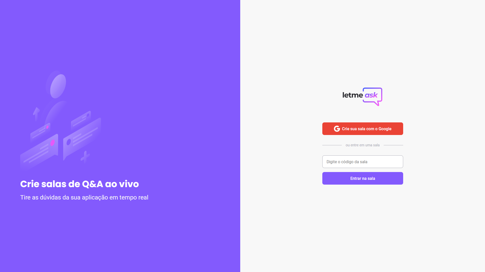
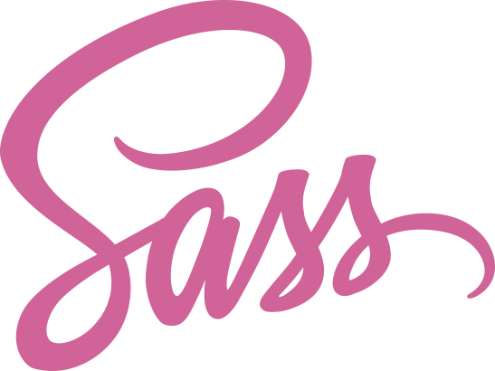
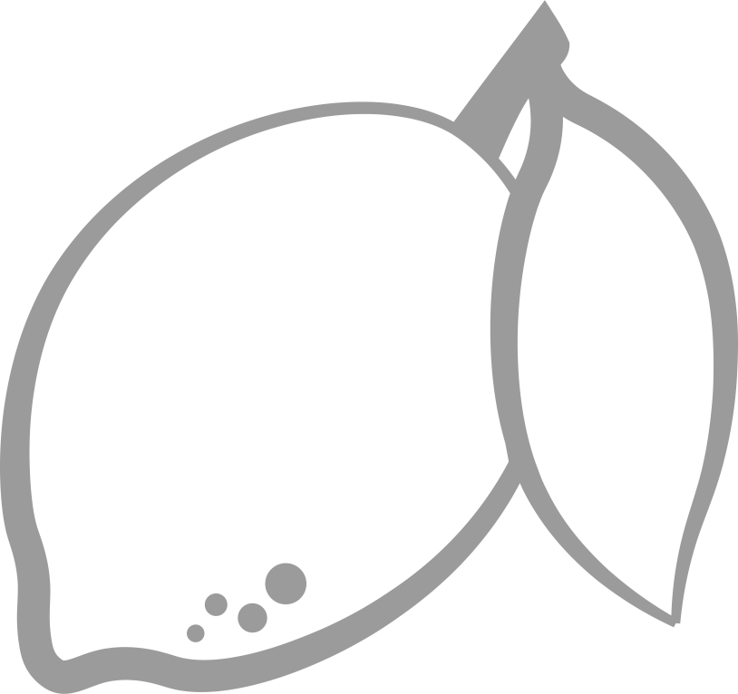

  

 

  

Layout do Projeto:

https://www.figma.com/file/u0BQK8rCf2KgzcukdRRCWh/Letmeask/duplicate

Foram usadas nesse projeto as seguintes tecnologias:

# TypeScript     
# React    
# Firebase    
# SASS    

    
 
  
  
<h1 align="center">
    
</h1>

     
  Filipe Lima - 2021

